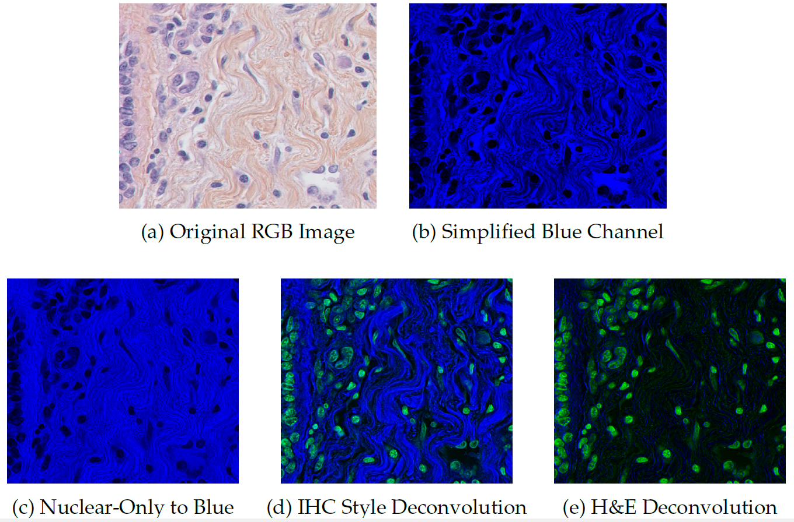
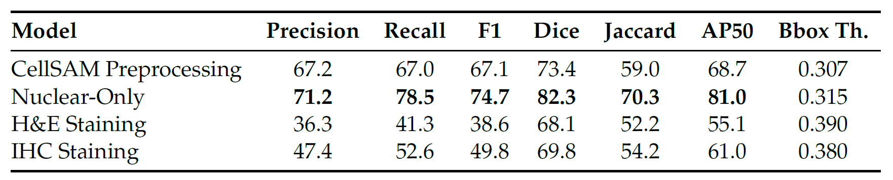
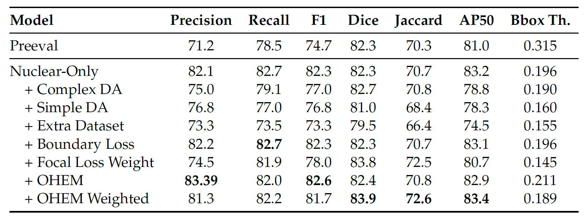
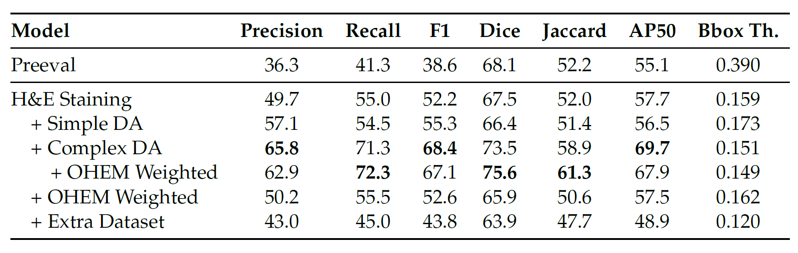
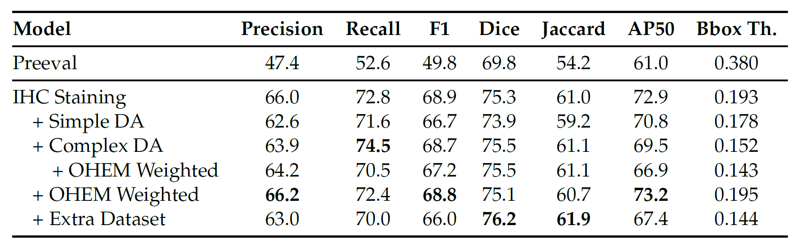

# Leukemia Detection Project

[](https://python.org/)
[](https://claude.ai/chat/LICENSE)
[](https://github.com/psf/black)

A comprehensive deep learning framework for leukemia detection in whole slide images (WSI), featuring both segmentation and classification models for automated analysis of bone marrow samples.

## 🎯 Motivation

Accurate cell segmentation and classification in microscopy images are fundamental for advancing biomedical research and clinical diagnostics. Tasks such as identifying pathological markers for disease diagnosis and quantifying cellular responses are paramount. Hematological analysis, for instance, relies heavily on morphological examination of blood and bone marrow cells for diagnosing and monitoring conditions like leukemia, where identifying and quantifying specific cell types (e.g., blast cells) is critical for patient management.

The emergence of digital pathology and high-throughput microscopy generates vast quantities of image data, creating both opportunities and challenges for automated analysis. While manual analysis by expert pathologists is the gold standard, it is labor-intensive, time-consuming, and subject to inter-observer variability. This project is motivated by the critical need for robust, accurate, and efficient automated methods for cellular image analysis, specifically to bridge the gap in effectively applying powerful foundation models like CellSAM to specialized biomedical imaging tasks.

## 🔬 Overview

This project implements state-of-the-art deep learning approaches for:

* **Cell Segmentation** : Automated detection and segmentation of individual cells using CellSAM
* **Cell Classification** : Binary classification of CD34+ and CD34- myeloblasts
* **Annotation Processing** : Tools for converting between different annotation formats
* **Data Pipeline** : Complete preprocessing pipeline from WSI to training-ready datasets

## 🚀 Features

* **End-to-End WSI Processing**: A complete pipeline from raw Whole Slide Images (WSI) to training-ready datasets.
* **Advanced Preprocessing** : Includes color deconvolution, pseudo-RGB channels creation, patch extraction, and quality filtering
* **Annotation Handling** : Process QuPath annotations and GeoJSON files
* **Cell Segmentation** : Segment individual cells using using deep learning models
* **Cell Classification** : Classify cells as positive/negative for CD34 marker
* **Data Pipeline** : Complete pipeline from raw WSI to training-ready datasets
* **Visualization** : Interactive visualization tools for annotations and predictions
* **Evaluation**: Comprehensive evaluation metrics (Deepcell and Coco)
* **Extensible and Configurable**: Leverages YAML configuration files for easy management of parameters and experiments

## 📁 Project Structure

The project is organized into a modular structure to separate concerns and improve maintainability.

```

├── environment.yaml          # Conda environment specificationleukemia-detection/
├── configs/                  # YAML configuration files for experiments
│   ├── classification/
│   ├── data/
│   └── train/
├── scripts/                  # Main executable scripts for the pipeline
│   ├── data_processing.py
│   ├── segmentation_training.py
│   ├── cell_classification.py
│   └── cell_inference.py
├── src/                      # Core source code
│   ├── common/               # Shared utilities and base configurations
│   ├── data/                 # Data loading and processing modules
│   ├── segmentation/         # Segmentation models, training, and evaluation
│   └── classification/       # Classification models, training, and evaluation
├── docs/                     # Documentation and images for the README
├── notebooks/                # Jupyter notebooks for analysis and exploration
├── tests/                    # Unit and integration tests
├── environment.yaml          # Conda environment specification
└── README.md                 # This file
```

## 🛠️ Installation

**Prerequisites:** [Anaconda](https://www.anaconda.com/products/distribution) or [Miniconda](https://docs.conda.io/en/latest/miniconda.html) must be installed.

1. **Clone the repository:**

   ```bash
   git clone https://github.com/danikvh/leukemia-detection.git
   cd leukemia-detection
   ```
2. **Create the Conda environment:**
   This command will create a new environment named `leukemia-detection` (or as specified in the `environment.yaml` file) and install all required dependencies.

   ```bash
   conda env create -f environment.yaml
   ```
3. **Activate the environment:**

   ```bash
   conda activate leukemia-detection
   ```

## 🚀 Usage & Workflow

The project provides a set of command-line scripts to execute the entire machine learning pipeline. The workflow is modular, allowing you to either prepare new training data or run a full inference pipeline on new images.

The main script for data handling, `scripts/data_processing.py`, operates using different subcommands (`extract-annotations` and `extract-patches`) depending on the goal.

### **Workflow 1: Preparing a Training Dataset (from Ground-Truth Labels)**

This workflow is used when you have manually annotated WSI files (e.g., as `.geojson` files) and want to create a dataset to train your segmentation and classification models.

**Goal:** `WSI + Annotations` → `Training-Ready Patches & Cells` → `Trained Models`

#### **Step 1.A: Extract Patches and Cells from Annotations**

Use the `extract-annotations` command to process WSI files and their corresponding GeoJSON annotations. This will generate labeled image patches and individual cell crops for training.

```bash
python scripts/data_processing.py extract-annotations \
    --config configs/data/annotations_extraction.yaml \
    --svs-dir /path/to/raw/wsi \
    --geojson-dir /path/to/ground-truth/geojson \
    --output-dir /path/to/training_dataset
```

#### **Step 1.B: Train the Segmentation Model**

Use the patches and masks generated in the previous step to train the CellSAM segmentation model.

```bash
python scripts/segmentation_training.py \
    --stage1_config configs/train/stage1.yaml \
    --stage2_config configs/train/stage2.yaml \
    --dataset_config configs/datasets/fe_ihc.yaml \
    --output_dir outputs/segmentation_models
```

#### **Step 1.C: Train the Classification Model**

Use the labeled cell crops from Step 1.A to train the classification model. The `--optimize-thresholds` flag is highly recommended to automatically find the best decision boundaries after training.

```bash
python scripts/cell_classification.py \
    --config configs/classification/trainval_binary_config.yaml \
    --output-dir outputs/classification_models \
    --optimize-thresholds
```

### **Workflow 2: Full Inference on a New WSI (with a Trained Model)**

This workflow is used when you have a new, unlabeled WSI and want to apply your trained models to perform a full analysis.

**Goal:** `New WSI` → `Segmented Cells` → `Classification Results & Report`

#### **Step 2.A: Segment WSI and Extract Cells**

Use the `extract-patches` command with the `--generate-mask` flag. This leverages your trained segmentation model (`--model-path`) to perform inference on the WSI, identify all cells, and save them as individual image crops.

```bash
python scripts/data_processing.py extract-patches \
    --config configs/data/patch_extraction.yaml \
    --svs-dir /path/to/new/wsi \
    --qupath-project /path/to/new/qupath_project_with_rois \
    --output-dir /path/to/inference_output \
    --generate-mask \
    --model-path /path/to/your/trained_segmentation_model.pth
```

#### **Step 2.B: Run Classification Inference**

Run the trained classification model on the folder of cell crops generated in the previous step. This script will classify each cell and create a comprehensive summary report for the entire WSI.

```bash
python scripts/cell_inference.py \
    --config configs/classification/inference_binary.yaml \
    --img-dir /path/to/inference_output  # Main folder containing extracted cells \
    --output-dir outputs/final_reports
```

## 📊 Results

This section presents key quantitative results and illustrative examples from the project, demonstrating the performance of the CellSAM model under various conditions and preprocessing strategies.

### Visualizing Color Deconvolution

Effective preprocessing, especially color deconvolution for stained images, is crucial for CellSAM's performance. The figure below illustrates different preprocessing strategies applied to a representative TNBC-Extended dataset image:



**Figure Description:** Visual comparison of preprocessing strategies applied to a representative TNBC-Extended dataset image. (a) Original RGB input. (b) Image preprocessed using a simplified approach, converting the input to be primarily represented in the Blue channel. (c) Image after color deconvolution, where only the Hematoxylin component is utilized and assigned to the Blue channel. (d) Image after color deconvolution, with the Hematoxylin component assigned to the Green channel and the DAB component to the Blue channel (IHC stain). (e) Image after color deconvolution, with the Hematoxylin component assigned to the Green channel and the Eosin component to the Blue channel (H&E stain). [Page 49]

### Key Quantitative Results

The following tables summarize the segmentation performance of the CellSAM model across different stages of the project, evaluated using metrics such as Precision, Recall, F1-score, Dice Similarity Coefficient, Jaccard Index, and Average Precision at 0.5 IoU (AP50).

#### Table 1: Performance Metrics of Pre-trained CellSAM Model

An initial evaluation of selected preprocessing strategies on a subset of the TNBC-Extended dataset using the pre-trained CellSAM model. The Nuclear-Only approach yielded the best performance among the tested configurations, outperforming even the default CellSAM preprocessing.



#### Table 2: Segmentation Performance of CellSAM Fine-tuned (Nuclear-Only Preprocessing Pipeline)

Results from fine-tuning CellSAM on the TNBC-Extended dataset using the Nuclear-Only preprocessing pipeline. The Nuclear-Only preprocessing, when combined with a weighted OHEM approach during Stage 2 neck training, consistently yielded the best segmentation performance.



#### Table 3: Segmentation Performance of CellSAM Fine-tuned (H&E-Specific Two-Channel Color Deconvolution)

Results from fine-tuning CellSAM on the TNBC-Extended dataset using H&E-specific two-channel color deconvolution. Complex data augmentation yielded markedly better results for this richer input representation.



#### Table 4: Segmentation Performance of CellSAM Fine-tuned (IHC-Specific Two-Channel Color Deconvolution)

Results from fine-tuning CellSAM on the TNBC-Extended dataset using IHC-specific two-channel color deconvolution. This approach generally outperformed the H&E-specific method and provided a stronger starting point after baseline fine-tuning.


